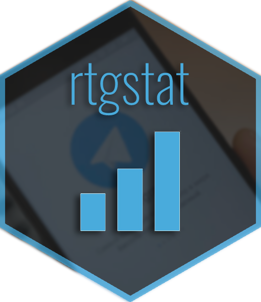

# rtgstat - R пакет для работы с TGstat API<a href='https://cran.r-project.org/package=rtgstat'></a>

<!-- badges: start -->
[](https://github.com/selesnow/rtgstat/actions)
[](https://lifecycle.r-lib.org/articles/stages.html#experimental)
<!-- badges: end -->

Пакет `rtgstat` включает в себя функции для работы со всеми методами [TGstat Search API](https://api.tgstat.ru/docs/ru/start/intro.html#api-%D0%BF%D0%BE%D0%B8%D1%81%D0%BA%D0%B0-api-search) и [TGstat Stat API](https://api.tgstat.ru/docs/ru/start/intro.html#api-%D1%81%D1%82%D0%B0%D1%82%D0%B8%D1%81%D1%82%D0%B8%D0%BA%D0%B8-api-stat). 

На данный момент в `rtgstat` доступны следующие функции, и соответствующие им методы API:

* `tg_auth()` - [Авторизация](https://api.tgstat.ru/docs/ru/start/token.html)
* `tg_channel()` - [Получение информации о канале](https://api.tgstat.ru/docs/ru/channels/get.html)
* `tg_channel_stat()` - [Получение статистики канала](https://api.tgstat.ru/docs/ru/channels/stat.html)
* `tg_channel_posts()` - [Получение списка публикаций канала](https://api.tgstat.ru/docs/ru/channels/posts.html)
* `tg_channel_mentions()` - [Получение списка упоминаний](https://api.tgstat.ru/docs/ru/channels/mentions.html)
* `tg_channel_forwards()` - [Получение списка репостов из канала](https://api.tgstat.ru/docs/ru/channels/forwards.html)
* `tg_channel_subscribers()` - [Получение кол-ва подписчиков в динамике *](https://api.tgstat.ru/docs/ru/channels/subscribers.html)
* `tg_channel_views()` - [Получение кол-ва просмотров в динамике *](https://api.tgstat.ru/docs/ru/channels/views.html)
* `tg_post()` - [Получение данных о публикации](https://api.tgstat.ru/docs/ru/posts/get.html)
* `tg_post_stat()` - [Получение статистики публикации](https://api.tgstat.ru/docs/ru/posts/stat.html)
* `tg_posts_search()` - [Поиск публикаций *](https://api.tgstat.ru/docs/ru/posts/search.html)
* `tg_mentions_by_period()` - [Динамика упоминания ключевого слова по периодам *](https://api.tgstat.ru/docs/ru/words/mentions-by-period.html)
* `tg_mentions_by_channels()` - [Упоминания ключевого слова в разрезе каналов *](https://api.tgstat.ru/docs/ru/words/mentions-by-channels.html)
* `tg_categories()` - [Список категорий **](https://api.tgstat.ru/docs/ru/database/categories.html)
* `tg_languages()` - [Список языков **](https://api.tgstat.ru/docs/ru/database/languages.html)
* `tg_countries()` - [Список стран **](https://api.tgstat.ru/docs/ru/database/countries.html)
* `yg_api_usage()` - [Статистика запросов к API **](https://api.tgstat.ru/docs/ru/usage/stat.html)

Звёздочкой \* отмечены методы, доступные только на платных тарифах API.

Двумя звёздами \*\* отмечаны методы, доступные на всех тарифах и не участвующие в тарификации.

## Устновка

На данный момент пакет `rtgstat` можно устновить из [GitHub](https://github.com/):

``` r
# install.packages("devtools")
devtools::install_github("selesnow/rtgstat")
```

## Авторизация

Для прохождения авторизации вам необходимо активировать в своём профиле TGstat один из доступных [тарифов](https://api.tgstat.ru/) TGstat API.


Более подробно о токенах и работе с ними читай в [официальной справке](https://api.tgstat.ru/docs/ru/start/token.html).

## Пример использования

Пример запроса данных из TGstat API:

``` r
library(rtgstat)

tg_auth('Ваш токен')

# Замените на ID вашего канала
tg_set_channel_id('R4marketing')

# Статистика канала
stat <- tg_channel_stat()
subscribers <- tg_channel_subscribers()
views <- tg_channel_views()

# Статистика публикации
posts <- tg_channel_posts()
post_stat <- tg_post_stat(post_id = posts$link[1])
post_views    <- post_stat$views
post_forwards <- post_stat$forwards
post_mentions <- post_stat$mentions

# Упоминания
mentions_dinamics <- tg_mentions_by_period(query = 'Алексей Селезнёв')
mentions_channels <- tg_mentions_by_channels(query = 'Алексей Селезнёв')
mentions   <- mentions_channels$items
m_channels <- mentions_channels$channels
```

## Автор
Alexey Seleznev, Head of analytics dept. at [Netpeak](https://netpeak.net)
<Br>Telegram Channel: [R4marketing](https://t.me/R4marketing)
<Br>email: selesnow@gmail.com
<Br>facebook: [facebook.com/selesnow](https://www.facebook.com/selesnow)
<Br>blog: [alexeyseleznev.wordpress.com](https://alexeyseleznev.wordpress.com/)

